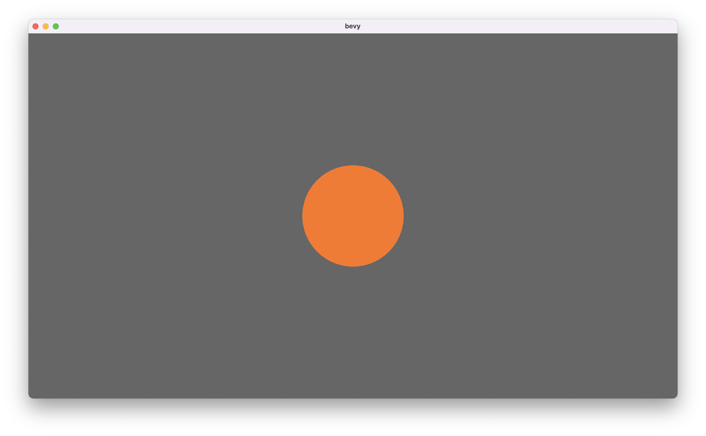

# Markdown test

* [Paragraphs](#paragraphs)
* [Headings](#headings)
* [Styles](#styles)
* [Quotes](#quotes)
* [Code](#code)
* [Links](#links)
* [Images](#images)
* [Lists](#lists)
* [Task lists](#task-lists)
* [Footnotes](#footnotes)

# Paragraphs

So you can have a bunch of text that's just ordinary and boring.
If you try to write in a new line that usually doesn't work but you can follow it with a \\ to make it wrap to a new line.\
Just like this.

Or you can just leave an empty line in between if you want it to leave extra breathing room.

# Headings

# Large heading

## Smaller heading

### Even smaller heading

#### Really tiny heading!

##### Can we make it smaller?

###### Yes we can!

# Styles
**Some bold text** followed by __some more bold text__ but then *some italic text appears* and _even more italic text_.

~~Will strikethrough follow their lead though?~~

**You can also nest _italic with_ bold**

***You can even just have everything be really strong and dancy***

# Quotes
> If you think you can do a thing or think you can't do a thing, you're right.\
> —Henry Ford

# Code
```rs
struct Magic<T> {
  value: T
}
fn cool() -> Magic<T> {
  return Magic {
    value: 100
  };
}
```

# Links
[A cool website](https://mathspy.me)

# Images


# Lists
* This is some cool list
    1. It can even contain other lists inside of it
        * And those lists can contain OTHER LISTS!
            1. Listception
            2. Listception
* Yeah I agree
    - [ ] Testing
* It's one of the coolest lists every written!

1. This is a normal numbered list though
2. So it's a bit less interesting
    1. Except when it contains more lists again!
3. Because no listception
    1. Or not!

# Task lists
- [ ] NOT Checked
- [x] Checked
- [ ] Some more
- [x] Or some less

# Footnotes
This is some random text[^1] that talks about nothing at all[^note].

[^1]: My reference.
[^note]: This was supposed to work.
